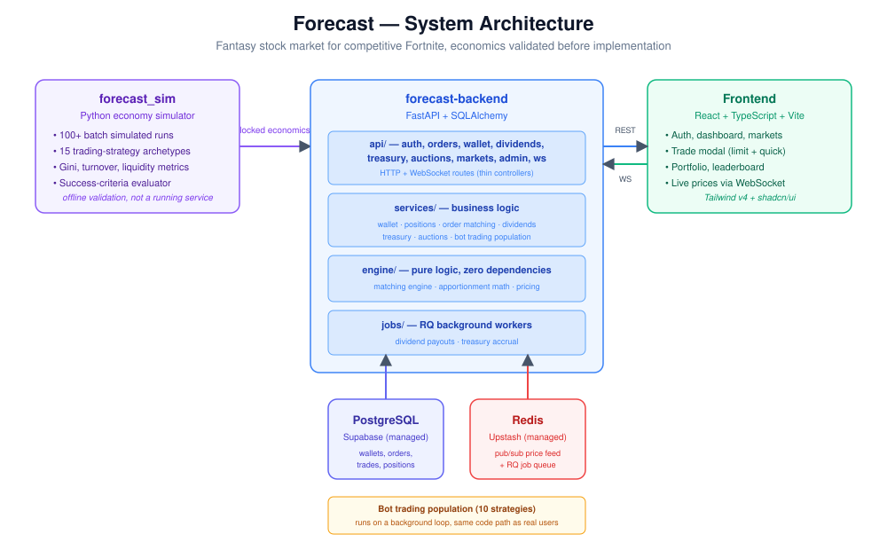

# Forecast — a fantasy stock market for competitive Fortnite

Users get fantasy cash, "IPO" professional Fortnite players as tradeable stocks, trade shares against a real order-matching engine, and earn dividends when their players place well in tournaments (Cash Cups, FNCS, the Global Championship). The economics — transaction fees, dividend pool sizes, treasury yield, starting capital — aren't guesses: they were validated ahead of time in a standalone Monte Carlo-style simulation before a single line of the live product was written.

This repo contains all three pieces: the simulation that validated the economics, the live backend, and the web frontend.

## Why this project is more than a CRUD app

- **The economics were validated before they were built.** `forecast_sim/` runs a full synthetic market — hundreds of bot and human agents, 15 trading-strategy archetypes, multiple tournament tiers, a full trading/dividend/treasury cycle — across batches of 100+ simulated runs, measuring things like wealth Gini coefficient, turnover, and bot/human behavioral symmetry, specifically to catch runaway inflation or degenerate strategies *before* they'd matter in a real product.
- **Money and share conservation are enforced at the database level, not just in application code.** Every trade, dividend payout, and auction settlement is designed so cash and shares are conserved exactly — down to the cent and the share — using exact largest-remainder apportionment (the same rounding method proven correct in the simulator) rather than naive proportional math that leaks pennies.
- **A real order-matching engine**, not a mocked one: price-time priority, partial fills, resting limit orders, and a "quick buy/sell" market-order path with synthetic liquidity that's hard-capped by actual share inventory (a real bug caught and fixed during live testing — see `PROJECT_STATUS.md`).
- **A bot liquidity/trading population** that trades through the exact same code path a human's browser click does — no privileged shortcuts — running on a live background loop, admin-tunable at runtime without a redeploy.
- **Built and debugged against real free-tier infrastructure** (Supabase Postgres, Upstash Redis), not just local mocks — including working through real-world gotchas like Supabase's IPv6-only direct connection and Upstash's TLS requirement.

## Architecture



```
forecast_sim/         Python economy simulator (validation tool, not a running service)
forecast-backend/     FastAPI + Postgres + Redis — the live REST/WebSocket API
Premium Esports Stock Market Front End/project/   React + Vite + Tailwind frontend
```

**Backend stack:** FastAPI, SQLAlchemy 2.0, Alembic migrations, Postgres, Redis (pub/sub + RQ job queue), JWT auth.
**Frontend stack:** React, Vite, TypeScript, Tailwind v4, shadcn/ui, Recharts.

## Status

This is an actively developed alpha, not a finished product. See [`PROJECT_STATUS.md`](./PROJECT_STATUS.md) for exactly what's built, what's verified working against live infrastructure, known limitations, and what's left.

## Running it locally

Full setup walkthrough (free Postgres/Redis accounts, environment variables, migrations, seeding an admin user) is in [`forecast-backend/README_SETUP.md`](./forecast-backend/README_SETUP.md). Short version, once configured, needs three processes running side by side:

```bash
# Terminal 1 — API server
cd forecast-backend && uvicorn app.main:app --reload

# Terminal 2 — background job worker (dividend payouts, treasury accrual)
# On macOS/Linux:
cd forecast-backend && rq worker forecast-default --url <your REDIS_URL>
# On Windows, RQ's normal worker doesn't run at all (needs os.fork() and
# signal.SIGALRM, neither of which exist on Windows). Use the bundled
# wrapper script instead (see README_SETUP.md for why):
cd forecast-backend && python -m app.jobs.windows_worker

# Terminal 3 — frontend
cd "Premium Esports Stock Market Front End/project" && npm install && npm run dev
```

## Screenshots

_Coming soon._
